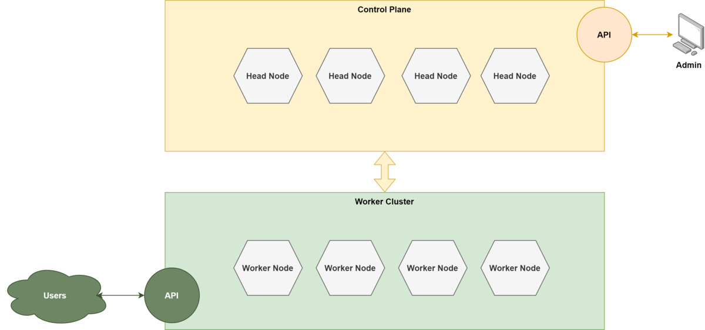
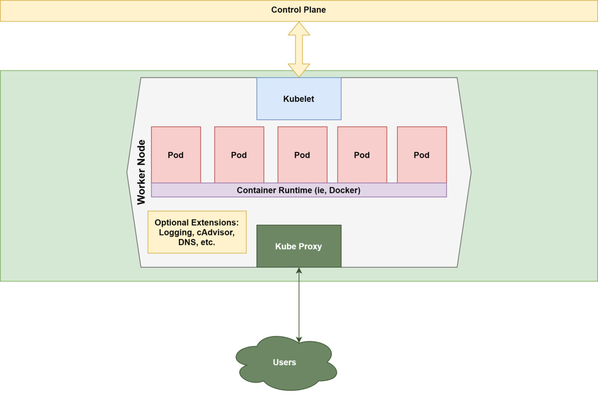
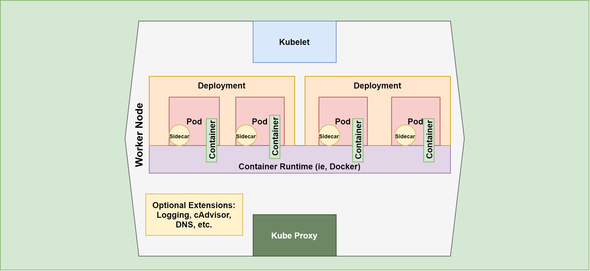
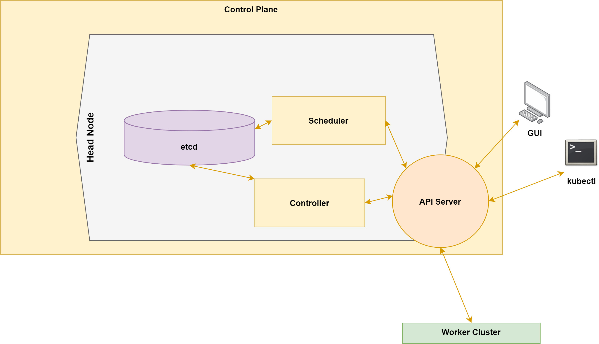

# How Kubernetes works

Kubernetes is the most prominent technology in modern microservices. It is designed to make managing microservices clusters of containerized applications simpler and more automated. Beneath this simple notion is a world of complexity. This article gives you a detailed conceptual understanding of how this central technology works.

One helpful way to think about Kubernetes is as a distributed operating system for containers. It provides the tools and commands necessary for orchestrating the interaction and scaling of containers (most commonly Docker containers) and the infrastructure containers run on. A general tool designed to work for a wide range of scenarios, Kubernetes is a very flexible system—and very complex.

### Kubernetes worker nodes and control plane
There are two aspects to Kubernetes: **the worker nodes and the control plane**.  
* The worker nodes are where the actual containerized applications exist along with the necessary Kubernetes tooling.  
* The control plane is where the tools for managing this cluster lives.

As you can see in Figure 1, the architecture is split between worker nodes and head nodes responsible for running workloads and running management tools, respectively.

Nodes in both cases are machines, virtual or actual.

### Scaling Kubernetes nodes vs. workloads
It’s important to note that Kubernetes is aware of the underlying infrastructure as the resources (compute, memory, disk, and network) available for its use in running worker node workloads, but it doesn’t directly control them. Kubernetes is responsible for scaling the workloads, but a higher order mechanism (like public cloud autoscaling or manual intervention) is responsible for adjusting the availability of nodes. A controller (which you will learn about shortly) is available for interacting with external systems for this purpose.

## Kubernetes worker node components

Figure 2 illustrates the essential elements of a Kubernetes worker node. Let’s take a look at each of these components.

### Kubelet
A kubelet is a “small” program running on the worker node responsible for negotiating between the control plane and the node. Its core purpose is to enforce the directives coming from the head node cluster upon the pods, and report back the current condition of the worker loads.

### Kube Proxy
The kube proxy is responsible for enforcing network rules on the node and allowing for traffic to and from the node.

**The kube proxy is distinct from ingress, which operates at the cluster level and defines rules for the network routes into the cluster.**

### Pods
Pods are the discrete unit of work on the node. Pods are the level of replication.  
They are an abstraction that wraps one or multiple containerized applications. Pods provide a way to logically group and isolate containers that run together, while still allowing inter-pod communication on the same machine. The relationship between containers and pods is controlled by Kubernetes deployment descriptors.

### Deployments and ReplicaSets
Pods are usually configured and deployed as part of a ReplicaSet. A ReplicaSet defines the desired runtime characteristics of the pod, and causes Kubernetes to work to maintain that state. ReplicaSets are usually defined by a Deployment, which defines both the ReplicaSet parameters and the strategy to use (i.e., whether pods are updated or recreated) when managing the cluster.

### Sidecars
At the pod level, extra functionality is enabled via sidecar add-ons. Sidecars handle tasks like pod-level logging and stats gathering.

Figure 3 provides a more detailed look at the pods in a worker node.

## Kubernetes control plane
So far we’ve focused on understanding the worker side of things. Let’s turn now to the controller side, and gain an understanding of how Kubernetes operates to control the operation of the cluster.

Figure 4 offers a detailed look at the head node components.

### Etcd
The simplest-to-understand component is etcd (pronounced “et-cee-dee”). Etcd is a distributed object store that acts as the database of record for the configuration and state of the entire cluster.

### API server
The API server is the central communication mechanism for the cluster. It brokers the interaction between the control plane, the worker nodes, and the administrators as they apply configuration changes via the Kubernetes command line tools (like kubectl) or other UI.

### Scheduler
The scheduler is responsible for identifying the node that pods will run on. The details of how this is determined vary based on the characteristics of the pods and the existing state of the available nodes. The strategy for how the scheduler approaches this decision making can be tuned all the way up to the ability to write custom schedulers. The scheduler interacts with the API server in performing its work.

### Controller
The controller component is responsible for keeping the cluster in the desired state as configured, and moving it towards that state when it drifts away from it. The controller acts as a kind of thermostat that specifies a desired state and then works to maintain it.

In Kubernetes terminology, you create an object, which is a persistent entity logged within etcd. The object is a record for how things should be. The controller then acts to ensure that the object has the desired specs, or properties.

As an example, a ReplicaSet (discussed above) defines how many pods should be running based on usage criteria. The ReplicaSet is the object, and the specified pod count is the spec. The actual state of the cluster with respect to that ReplicaSet is the status. The controller receives consistent reports from the cluster as to this status, and takes action to bring the status into agreement with the specs by creating or destroying pods.

### Container image repository
A final component to be aware of is the image repository/registry. This component exists outside the cluster and is accessed by administrators and the control plane to download required container definitions. Registries are hosted by a variety of organizations including **Docker Hub** and can be public or private. The major cloud providers all offer managed repositories for enterprise use.

## Summary: Containers vs Pods vs Clusters

### Container  
A container is a package with the program to execute and all its dependencies, such as the code, runtime, system libraries, etc, bound together in a box,

### Pod 
A pod (the smallest deployable unit in Kubernetes) is a group of one or more containers, with shared storage/network resources, and a specification for how to run the containers.  
Containers for your containers, in a sense.  

### Cluster
A cluster is a board that provides the circuitry to run all the pods (which have the container instances in them) in an orchestrated manner as defined by the users

So there’s a symbiotic relationship between these terms:

Container → Pod → Cluster

A container runs logically in a pod (though it also uses a container runtime);  
A group of pods, related or unrelated, run on a cluster. A pod is a unit of replication on a cluster;  
A cluster can contain many pods, related or unrelated and grouped under the tight logical borders called namespaces.  

